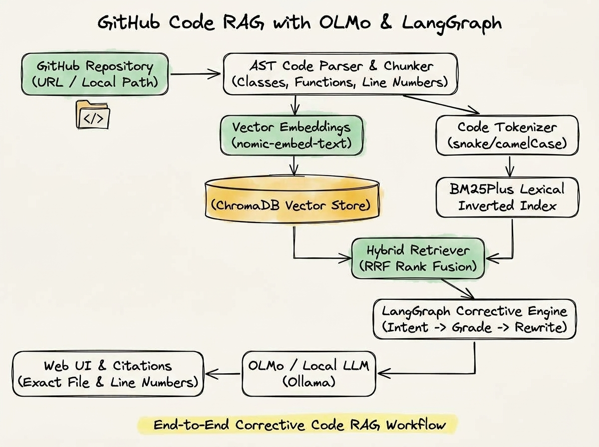

# 💻 GitHub Code RAG with OLMo & LangGraph

An advanced, production-grade **Code Retrieval-Augmented Generation (RAG)** system designed to ingest, parse, index, and query any public GitHub repository or local codebase with exact file and line-level citations.

Powered by **AST-aware code chunking**, **ChromaDB + BM25Plus Hybrid Retrieval (RRF)**, and a **Corrective LangGraph Workflow** using **OLMo** (or local Ollama models like `llama3.2`).

---

## 🏗️ Architecture



```text
                  GitHub Repository (URL or Local)
                                 │
                                 ↓
                     [1] REPOSITORY INGESTION
                         • Git Cloner / Local Loader
                         • File & Extension Filtering
                                 │
                                 ↓
                        [2] CODE PARSING (AST)
                         • Python AST & Multi-language Syntax Extractors
                         • Symbol-Level Chunks (Classes, Functions, Methods)
                         • Rich Line Number Metadata (Start–End lines)
                                 │
                                 ↓
                         [3] HYBRID INDEXING
                         ┌───────┴───────┐
                         ↓               ↓
                  nomic-embed-text    BM25Plus Tokenizer
                         ↓               ↓
                     ChromaDB       Inverted Index
                         │               │
                         └───────┬───────┘
                                 │
  User Question ─────────────────┼────────────────────────┐
                                 ↓                        ↓
                 [4] LANGGRAPH WORKFLOW                   │
                         • Query Intent Analysis          │
                         • Hybrid Search (RRF Fusion)     │
                         • Relevance Grader               │
                         • Query Rewriting (Corrective)   │
                         • Grounded OLMo Reasoning        │
                                 │                        │
                                 ↓                        │
                 [5] ANSWER & EXACT CITATIONS ────────────┘
                         • Natural Language Explanation
                         • 📄 File Path + 📍 Line Ranges
                         • 🏷️ Symbol Names & Types
```

---

## 🔍 How It Works (Under the Hood)

Traditional RAG systems split text arbitrarily every *N* characters or tokens, slicing code across functions, breaking indentation, and losing vital symbol context. **GitHub Code RAG** solves this through a dedicated 5-stage engineering pipeline:

### 1. Repository Ingestion & Smart Filtering
- **Input Flexibility**: Accepts both GitHub URLs (`https://github.com/owner/repo`) and local directory paths.
- **Shallow Cloning**: Performs depth-1 clones with automated caching in `data/repos/` to keep disk usage light and speeds high.
- **Smart Filtering**: Ignores lock files (`package-lock.json`, `poetry.lock`), binary files, virtual environments (`.venv`, `node_modules`), build directories, and dotfiles.

### 2. AST-Aware Code Parsing & Chunking
- **Abstract Syntax Tree (AST)**: Parses Python and source code into structural nodes (classes, functions, standalone methods).
- **Context Preservation**: Each chunk retains the complete functional block with exact `start_line`, `end_line`, `file_path`, `symbol_name`, and `symbol_type`.
- **Bounded Slicing**: Large classes and modules are sliced at logical method boundaries so embedding context windows are never overloaded.

### 3. Dual Hybrid Indexing (Dense + Sparse)

**Indexing** is the process of converting raw code files into searchable data structures so the AI can locate exact functions, classes, and logic in milliseconds without having to read through every file in the repository on every query.

The system builds **two complementary indices** simultaneously:

```text
                  AST-Parsed Code Chunks
                            │
            ┌───────────────┴───────────────┐
            ↓                               ↓
   [ Dense Vector Index ]         [ Sparse Lexical Index ]
      ChromaDB + Embeddings              BM25Plus
            │                               │
   • Meaning-based search          • Exact keyword search
   • Handles natural language      • Handles syntax & symbols
   • Finds concepts (e.g. auth)    • Finds names (e.g. JWTAuth)
```

1. **Semantic Vector Index (`vector_store.index` in ChromaDB)**:
   - Converts each chunk into a high-dimensional mathematical vector using `nomic-embed-text`.
   - **Meaning-Based Search**: If you ask *"How are requests authenticated?"*, the vector store locates `def verify_jwt_token()` even if the word *"authenticated"* is never explicitly used in that file.

2. **Sparse Lexical Index (`bm25_store.index` via BM25Plus)**:
   - Builds an inverted keyword index using code-aware tokenization (`camelCase`, `snake_case`, variable names).
   - **Exact Keyword Match**: If you ask for a specific symbol like `MLModelContainer` or `calculate_loss()`, BM25 finds the exact matching occurrence instantly without semantic drift.

| Index Type | Engine | Primary Strength | Weakness |
| :--- | :--- | :--- | :--- |
| **Dense Vector** | ChromaDB (`nomic-embed-text`) | Understands intent, questions, and conceptual descriptions. | Can miss exact variable or rare function names. |
| **Sparse Lexical** | BM25Plus | 100% precision on exact symbol, variable, and class names. | Does not understand synonyms or natural language. |

### 4. Hybrid Reciprocal Rank Fusion (RRF)
- Combines semantic vector similarity with BM25 keyword relevance using Reciprocal Rank Fusion:
  $$\text{RRF Score}(d) = \frac{1}{60 + \text{rank}_{\text{vector}}(d)} + \frac{1}{60 + \text{rank}_{\text{bm25}}(d)}$$
- Eliminates vector hallucination while ensuring rare variable and function names are retrieved accurately.

### 5. Corrective LangGraph State Machine
Queries run through a deterministic LangGraph workflow:
1. **Analyze Query**: Identifies user intent (`symbol_lookup`, `api_endpoint`, `code_explanation`) and extracts key code entities.
2. **Hybrid Retrieval**: Fetches top-$K$ candidate chunks.
3. **Relevance Grading**: Evaluates whether retrieved snippets contain the requested symbols.
4. **Corrective Query Rewriting**: If relevance checks fail, automatically rewrites the query with symbol aliases and re-retrieves.
5. **Grounded Generation**: Feeds the strictly bounded context into **OLMo** (or `llama3.2:latest`) with instructions to produce an explanation and exact file/line citations.

---

## 🚀 Getting Started

### 1. Prerequisites
- **Python 3.9+**
- **[Ollama](https://ollama.com)** installed and running locally:

```bash
# Pull the embedding model (required for vector search)
ollama pull nomic-embed-text

# Pull the LLM model
ollama pull llama3.2:latest
# (or ollama pull olmo)
```

### 2. Installation
Clone the repository and install the dependencies:

```bash
git clone <your-repo-url>
cd "git read RAG"
pip install -r requirements.txt
```

### 3. Launch the Application
Start the FastAPI server and web interface:

```bash
python run.py
```

The web application will be live at **[http://localhost:8000](http://localhost:8000)**.

---

## 🖥️ How to Use

### Step 1: Ingest a Codebase
1. Open [`http://localhost:8000`](http://localhost:8000) in your browser.
2. In the sidebar under **Ingest Repository**, enter either:
   - A public GitHub URL (e.g. `https://github.com/pallets/flask`)
   - A local path (e.g. `./tests/sample_repo`)
3. Click **Index Repository**. The system will clone, parse the AST, generate embeddings, and build the BM25 index.

### Step 2: Select Active Repository & Model
- Use the **Active Repository** dropdown in the sidebar to switch between indexed projects.
- The **Model** selector automatically detects your installed Ollama models.

### Step 3: Ask Codebase Questions
Type your question in the chat input bar or click one of the quick query pills:
- *"Where is the prediction API endpoint implemented?"*
- *"Explain the pipeline workflow and how data flows through the system."*
- *"Which function handles authentication or token verification?"*

### Step 4: Review Answers & Exact Citations
- Read the synthesized natural language explanation.
- Inspect the **Sources & Citations** cards to see exact file paths, line ranges (e.g., `Lines: 15–48`), and the raw code blocks.
- Expand the **Execution Trace** to see the LangGraph steps (Intent analysis, RRF retrieval stats, relevance grading).

---

## 🔌 REST API Endpoints

You can also interact with the system programmatically via REST API:

| Endpoint | Method | Description | Example Payload |
| :--- | :--- | :--- | :--- |
| `/api/health` | `GET` | Health check & active Ollama status | — |
| `/api/models` | `GET` | Lists available local Ollama LLMs | — |
| `/api/repos` | `GET` | Lists all indexed repository collections | — |
| `/api/index` | `POST` | Clones and indexes a repository | `{"repo_source": "https://github.com/...", "force_reindex": false}` |
| `/api/query` | `POST` | Runs the full LangGraph RAG pipeline | `{"repo_id": "flask", "question": "Where is route registered?"}` |

### API Query Example:
```bash
curl -X POST http://localhost:8000/api/query \
  -H "Content-Type: application/json" \
  -d '{
    "repo_id": "sample_repo",
    "question": "Where is the prediction API implemented?"
  }'
```

---

## 📁 Project Structure

```
git read RAG/
├── assets/
│   └── pipeline_diagram.jpg     # Architecture hand-drawn diagram
├── data/
│   ├── chroma_db/               # Persistent ChromaDB vector storage
│   ├── bm25/                    # Serialized BM25 keyword indices
│   └── repos/                   # Shallow-cloned Git repositories
├── src/
│   └── code_rag/
│       ├── config.py            # Pydantic system settings & file ignore rules
│       ├── api/
│       │   └── main.py          # FastAPI REST endpoints & static file mounting
│       ├── core/
│       │   ├── cloner.py        # Shallow Git cloner with caching & sanitization
│       │   ├── parser.py        # Python AST & multi-language symbol extractor
│       │   ├── chunker.py       # Syntax-aware chunker with start/end line bounds
│       │   └── models.py        # CodeChunk, RepoMetadata Pydantic models
│       ├── storage/
│       │   ├── vector_store.py  # ChromaDB vector store manager
│       │   └── bm25_store.py    # BM25Plus indexer with code-aware tokenizer
│       ├── rag/
│       │   ├── retriever.py     # Hybrid RRF search & context builder
│       │   ├── state.py         # LangGraph TypedDict state
│       │   └── graph.py         # LangGraph StateGraph (Analyze -> Retrieve -> Grade -> Rewrite -> Generate)
│       ├── services/
│       │   └── ollama.py        # Ollama client with auto-discovery & safe context bounding
│       └── static/
│           ├── index.html       # Clean web interface
│           ├── styles.css       # Warm editorial aesthetic stylesheet
│           └── app.js           # Client UI logic & Prism syntax highlighting
├── requirements.txt             # Python dependencies
├── run.py                       # Server entrypoint launcher
└── README.md                    # Project documentation
```

---

## 📄 License
MIT © 2026 Code RAG Contributors
